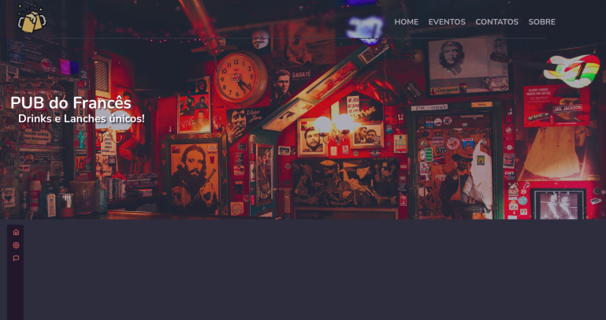
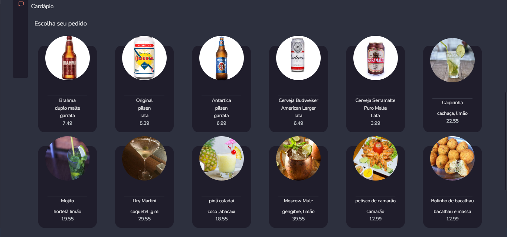

#  PROJETO FINAL MODULO 5 

# PUB-do-frances 🍻
Projeto final do módulo 5 da Resilia. Consistem em criar uma landing page utilizando a biblioteca React e consumir a api criada no módulo anterior..

## TECNOLOGIAS E FERRAMENTAS 💻
* JavaScript 
* CSS
* React
* Node JS
* Visual Studio Code

## LAYOUT 🎨

Página inicial

 

Consumo da Api de Bebidas, Drinks e Petiscos

## EQUIPE

<table>
  <tr>
    <td align="center"><a href="" <b>Marcilane Souza</b></a> <a href="https://www.linkedin.com/in/marcilane-souza-9427bb69/" title="">👩‍🎓</a></td>
    <td align="center"><a href="" <b>Karla Valeriano</b></a> <a href="https://www.linkedin.com/in/karla-valeriano-b01a351b8/" title=""> 👩‍🎓 </a></td>
    <td align="center"><a href="" <b>Paulo Oliveira</b></a> <a href="https://www.linkedin.com/in/paulooliveirv/" title="">👨‍🎓</a></td>
    <td align="center"><a href="" <b>Guilherme Carvalho</b></a> <a href="https://www.linkedin.com/in/guilhermeecarvalho/" title="">👨‍🎓</a></td>
